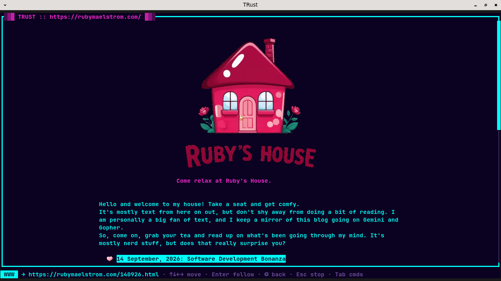
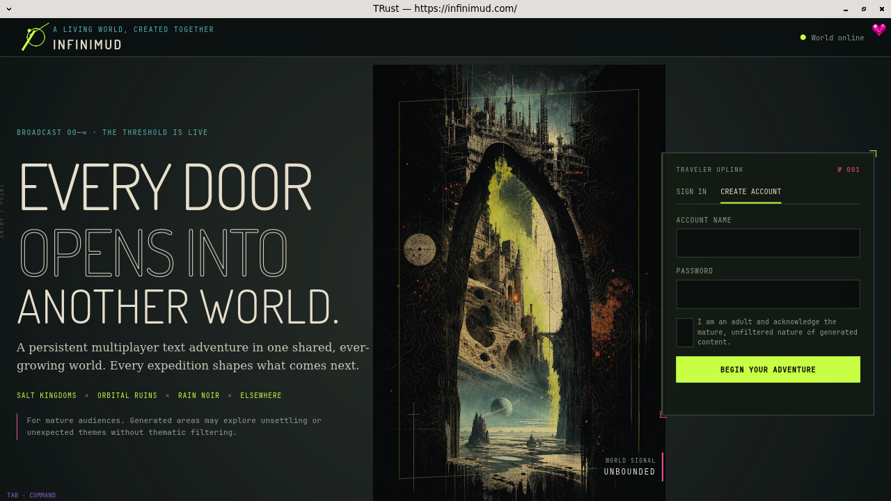
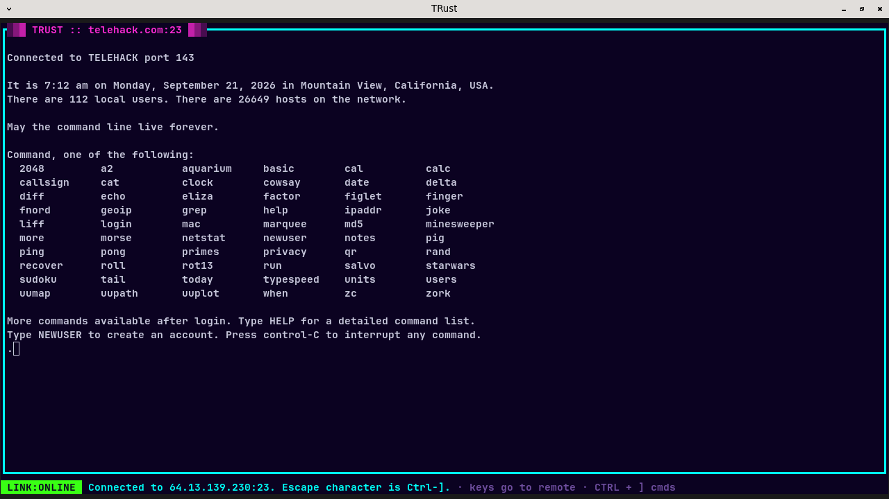

# TRust — Terminal browser in Rust

A terminal-based (and GUI) browser written in Rust, that's why it's called TRust.
Oh wait, did you know it also supports telnet, gopher, gemini, finger, and whois?
Oh, and HTTP. With the pure-Rust Lumen-forked JavaScript engine integrated directly.
Image support? We got it. Live JS rendering? Yup. Full CSS implementation? Yeah.

Browse the web, connect to MUDs/BBSes, and check out your favorite gopher holes and
gemini capsules, all in one place. Do you like YouTube or any other
audio/video content? If you have mpv installed, it will automatically
open the target in mpv for your viewing and listening pleasure.

Run `trust <address>` in your terminal, or `trust-desktop <address>` for a
desktop window. Tab opens the command panel to access the address bar or enter
additional commands. Type `help` for the options. See [INSTALL.md](INSTALL.md)
for instructions on how to compile it yourself.

**TRust — [Ruby's House](https://rubymaelstrom.com)**

**trust-desktop — [InfiniMUD](https://infinimud.com)**

**TRust — [Telehack](https://telehack.com)**

